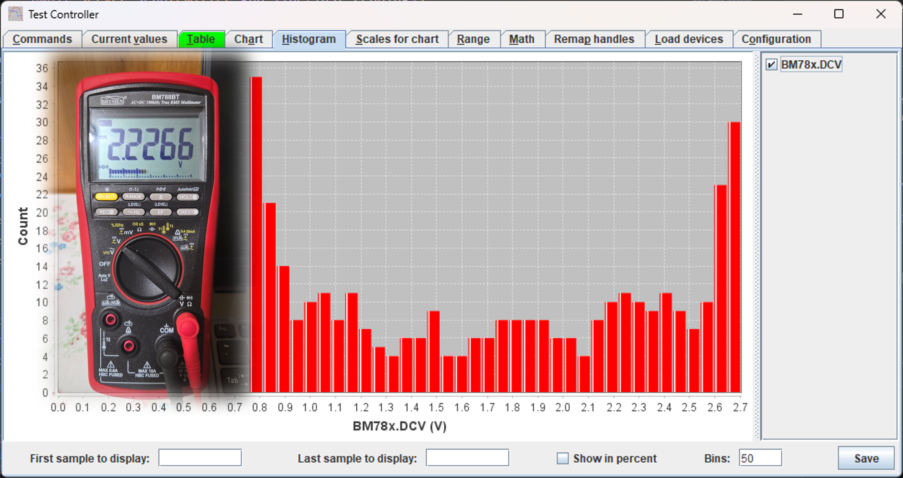

# brymenble-tc-bridge TestController Bridge

> **⚠️ Unofficial.** This is an independent, community-developed project. It is
> **not affiliated with, endorsed by, or sponsored by** Brymen Technology Corporation. "Brymen" and the device model names are trademarks of their
> respective owners.



Bridge a **Brymen BM78xBT** BLE multimeter into
[**TestController**](https://lygte-info.dk/project/TestControllerIntro%20UK.html)
(lygte-info.dk's freeware multi-device test & logging tool).

## Platform support

Linux and Windows are supported. macOS randomizes BLE device MAC addresses and behavior is not tested.

## Install

### Option A — Windows binary (no Python needed)

Download `brymenble-tc-bridge.exe` from the latest
[release](https://github.com/milksplash/brymenble-tc-bridge/releases) and
double-click it. No Python or dependencies are required.

### Option B — from source

```powershell
python -m venv .venv
.venv\Scripts\python -m pip install -r requirements.txt
```

`requirements.txt` installs the `brymenble` SDK from PyPI (which pulls in its
`bleak` dependency).

## Run

Explicit — MAC, custom password and port:

```powershell
.venv\Scripts\python -m bridge 12:34:56:78:9A:BC --password 4321 --port 7000
```

Without a MAC, the first BM78xBT found by scanning is used (defaults:
password `0000`, port `6000`):

```powershell
.venv\Scripts\python -m bridge
```

The Windows binary accepts the same arguments:

```powershell
brymenble-tc-bridge.exe 12:34:56:78:9A:BC --password 4321 --port 7000
```

## Connect TestController

1. Copy `testcontroller/BrymenBM78xBT.txt` into TestController's `Devices` folder.
2. Start TestController.
3. Go to the **Load devices** page.
4. Select **Brymen BM78xBT** from the drop-down list.
5. Press **Add**.
6. Press **Reconnect** — TestController jumps to the **Commands** page.
7. Press **Run**.

## Project layout

```
brymenble-tc-bridge/
├─ bridge/                 # Python package (BLE → TestController bridge)
│  ├─ __init__.py
│  ├─ cli.py               # CLI entry point (arg parsing, defaults)
│  ├─ __main__.py          # Enables `python -m bridge` → runs cli.main()
│  ├─ bridge.py            # Entry point (runnable directly) + reconnect loop
│  ├─ emitter.py           # Formats readings as TestController SingleValue lines
│  └─ transports.py        # TCP line server: framing + *IDN? handshake
├─ testcontroller/         # Third-party integration
│  └─ BrymenBM78xBT.txt    # TestController device definition (SingleValue driver)
├─ tools/                  # Dev / sim helpers
│  ├─ build_exe.py         # PyInstaller single-file .exe packaging
│  └─ simulate_meter.py    # Acts as the bridge with fake readings — configure/test
│                          #   TestController connection without a meter
├─ tests/                  # Offline unit tests (no meter or TestController needed)
│  ├─ conftest.py
│  ├─ test_bridge.py
│  ├─ test_emitter.py
│  └─ test_transports.py
├─ bridge entry points: brymenble-tc-bridge.spec, requirements*.txt, pyproject.toml
```

Data flows: `bridge/cli.py` wires up the BLE stream → `bridge/bridge.py`'s
reconnect loop → `bridge/emitter.py` formats each reading as a SingleValue
line, which `bridge/transports.py` serves over TCP; TestController connects
using the device definition in `testcontroller/BrymenBM78xBT.txt`.

## Tests

Offline unit tests (no meter or TestController needed):

```bash
.venv\Scripts\python -m pip install -r requirements-dev.txt
.venv\Scripts\python -m pytest
```

These cover the SingleValue emitter (`bridge/emitter.py` — ASCII-safe units,
base-unit scaling, mode tokens, overload/ASCII text) and the TCP line server
(`bridge/transports.py` — framing and the `*IDN?` handshake).

## Notes

- The meter's function **cannot be switched over BLE/TestController.**
- **TestController does not auto-reconnect its socket.** After a meter power cycle you must reconnect manually in TestController.

## License

MIT — see [LICENSE](LICENSE).

"Brymen" and the device model names are trademarks of their respective owners;
this project is not affiliated with or endorsed by Brymen Technology Corporation.